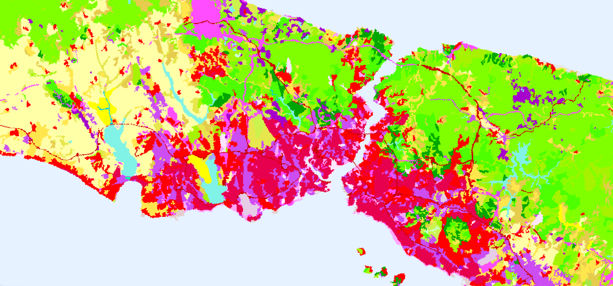
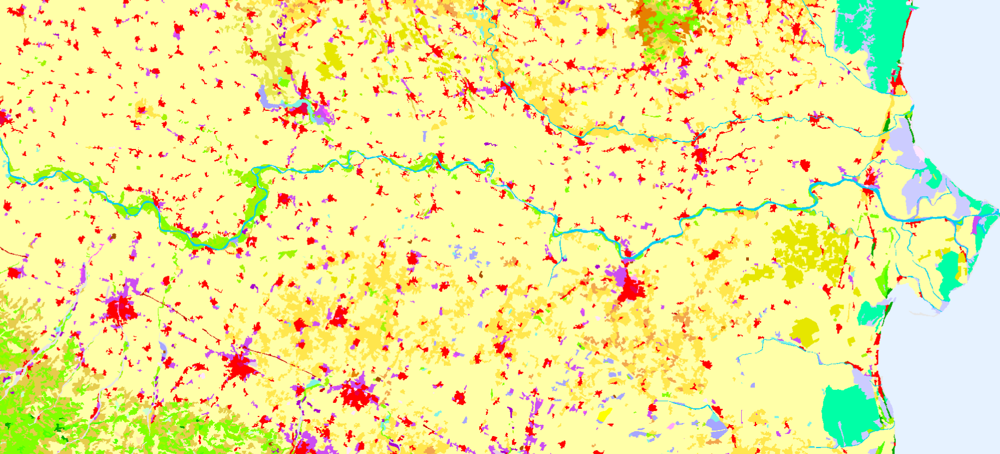

# CORINE Land Cover Accounting Layers

## Short description
 The CORINE Land Cover (CLC) Accounting Layers are CLC status layers modified for the purpose of consistent statistical analysis in the land cover change accounting system at EEA. 
 The modification combines CLC status and change layers in the 100m raster form in order to create homogeneous quality time series of CLC / CLC-change layers for accounting purposes.
 The CLC inventory consists of 44 land cover and land use classes derived from a series of satellite missions since it was first established. 
 There are altogether 5 mapping inventories implemented since 1986, producing five status layers (CLC1990, CLC2000, CLC2006, CLC2012, CLC2018), 4 CLC-Change layers for the corresponding periods (1990-2000, 2000-2006, 2006-2012, 2012-2018) and 4 CLC accounting layers for 2000, 2006, 2012 and 2018. 

## Band information
The `CLC-ACC` band values correspond to a land cover and land use classification scheme with class values ranging from 111 to 999. Please see the nomenclature and coloring scheme in the table below. For more details about the classes, please see the official [CORINE Land Cover nomenclature guidelines](https://land.copernicus.eu/user-corner/technical-library/corine-land-cover-nomenclature-guidelines/html/index.html) or the illustrated [nomenclature guidelines document](https://land.copernicus.eu/user-corner/technical-library/corine-land-cover-nomenclature-guidelines/docs/pdf/CLC2018_Nomenclature_illustrated_guide_20190510.pdf).

A visualisation script can be found in our [custom scripts repository](https://custom-scripts.sentinel-hub.com/copernicus_services/corine_land_cover-accounting_layers/).

### Table 2: CORINE Land Cover nomenclature and colouring scheme.

<table>
  <thead>
    <tr>
      <th>Value</th>
      <th>Color</th>
      <th>Label</th>
    </tr>
  </thead>
  <tbody>
    <tr>
      <td>111</td>
      <td style="background-color: #e6004d;"></td>
      <td>111 - Continuous urban fabric</td>
    </tr>
    <tr>
      <td>112</td>
      <td style="background-color: #ff0000;"></td>
      <td>112 - Discontinuous urban fabric</td>
    </tr>
    <tr>
      <td>121</td>
      <td style="background-color: #cc4df2;"></td>
      <td>121 - Industrial or commercial units</td>
    </tr>
    <tr>
      <td>122</td>
      <td style="background-color: #cc0000;"></td>
      <td>122 - Road and rail networks and associated land</td>
    </tr>
    <tr>
      <td>123</td>
      <td style="background-color: #e6cccc;"></td>
      <td>123 - Port areas</td>
    </tr>
    <tr>
      <td>124</td>
      <td style="background-color: #e6cce6;"></td>
      <td>124 - Airports</td>
    </tr>
    <tr>
      <td>131</td>
      <td style="background-color: #a600cc;"></td>
      <td>131 - Mineral extraction sites</td>
    </tr>
    <tr>
      <td>132</td>
      <td style="background-color: #a64d00;"></td>
      <td>132 - Dump sites</td>
    </tr>
    <tr>
      <td>133</td>
      <td style="background-color: #ff4dff;"></td>
      <td>133 - Construction sites</td>
    </tr>
    <tr>
      <td>141</td>
      <td style="background-color: #ffa6ff;"></td>
      <td>141 - Green urban areas</td>
    </tr>
    <tr>
      <td>142</td>
      <td style="background-color: #ffe6ff;"></td>
      <td>142 - Sport and leisure facilities</td>
    </tr>
    <tr>
      <td>211</td>
      <td style="background-color: #ffffa8;"></td>
      <td>211 - Non-irrigated arable land</td>
    </tr>
    <tr>
      <td>212</td>
      <td style="background-color: #ffff00;"></td>
      <td>212 - Permanently irrigated land</td>
    </tr>
    <tr>
      <td>213</td>
      <td style="background-color: #e6e600;"></td>
      <td>213 - Rice fields</td>
    </tr>
    <tr>
      <td>221</td>
      <td style="background-color: #e68000;"></td>
      <td>221 - Vineyards</td>
    </tr>
    <tr>
      <td>222</td>
      <td style="background-color: #f2a64d;"></td>
      <td>222 - Fruit trees and berry plantations</td>
    </tr>
    <tr>
      <td>223</td>
      <td style="background-color: #e6a600;"></td>
      <td>223 - Olive groves</td>
    </tr>
    <tr>
      <td>231</td>
      <td style="background-color: #e6e64d;"></td>
      <td>231 - Pastures</td>
    </tr>
    <tr>
      <td>241</td>
      <td style="background-color: #ffe6a6;"></td>
      <td>241 - Annual crops associated with permanent crops</td>
    </tr>
    <tr>
      <td>242</td>
      <td style="background-color: #ffe64d;"></td>
      <td>242 - Complex cultivation patterns</td>
    </tr>
    <tr>
      <td>243</td>
      <td style="background-color: #e6cc4d;"></td>
      <td>243 - Land principally occupied by agriculture with significant areas of natural vegetation</td>
    </tr>
    <tr>
      <td>244</td>
      <td style="background-color: #f2cca6;"></td>
      <td>244 - Agro-forestry areas</td>
    </tr>
    <tr>
      <td>311</td>
      <td style="background-color: #80ff00;"></td>
      <td>311 - Broad-leaved forest</td>
    </tr>
    <tr>
      <td>312</td>
      <td style="background-color: #00a600;"></td>
      <td>312 - Coniferous forest</td>
    </tr>
    <tr>
      <td>25</td>
      <td style="background-color: #4dff00;"></td>
      <td>313 - Mixed forest</td>
    </tr>
    <tr>
      <td>321</td>
      <td style="background-color: #ccf24d;"></td>
      <td>321 - Natural grasslands</td>
    </tr>
    <tr>
      <td>322</td>
      <td style="background-color: #a6ff80;"></td>
      <td>322 - Moors and heathland</td>
    </tr>
    <tr>
      <td>323</td>
      <td style="background-color: #a6e64d;"></td>
      <td>323 - Sclerophyllous vegetation</td>
    </tr>
    <tr>
      <td>324</td>
      <td style="background-color: #a6f200;"></td>
      <td>324 - Transitional woodland-shrub</td>
    </tr>
    <tr>
      <td>331</td>
      <td style="background-color: #e6e6e6;"></td>
      <td>331 - Beaches - dunes - sands</td>
    </tr>
    <tr>
      <td>332</td>
      <td style="background-color: #cccccc;"></td>
      <td>332 - Bare rocks</td>
    </tr>
    <tr>
      <td>333</td>
      <td style="background-color: #ccffcc;"></td>
      <td>333 - Sparsely vegetated areas</td>
    </tr>
    <tr>
      <td>334</td>
      <td style="background-color: #000000;"></td>
      <td>334 - Burnt areas</td>
    </tr>
    <tr>
      <td>335</td>
      <td style="background-color: #a6e6cc;"></td>
      <td>335 - Glaciers and perpetual snow</td>
    </tr>
    <tr>
      <td>411</td>
      <td style="background-color: #a6a6ff;"></td>
      <td>411 - Inland marshes</td>
    </tr>
    <tr>
      <td>412</td>
      <td style="background-color: #4d4dff;"></td>
      <td>412 - Peat bogs</td>
    </tr>
    <tr>
      <td>421</td>
      <td style="background-color: #ccccff;"></td>
      <td>421 - Salt marshes</td>
    </tr>
    <tr>
      <td>422</td>
      <td style="background-color: #e6e6ff;"></td>
      <td>422 - Salines</td>
    </tr>
    <tr>
      <td>423</td>
      <td style="background-color: #a6a6e6;"></td>
      <td>423 - Intertidal flats</td>
    </tr>
    <tr>
      <td>511</td>
      <td style="background-color: #00ccf2;"></td>
      <td>511 - Water courses</td>
    </tr>
    <tr>
      <td>512</td>
      <td style="background-color: #80f2e6;"></td>
      <td>512 - Water bodies</td>
    </tr>
    <tr>
      <td>521</td>
      <td style="background-color: #00ffa6;"></td>
      <td>521 - Coastal lagoons</td>
    </tr>
    <tr>
      <td>522</td>
      <td style="background-color: #a6ffe6;"></td>
      <td>522 - Estuaries</td>
    </tr>
    <tr>
      <td>523</td>
      <td style="background-color: #e6f2ff;"></td>
      <td>523 - Sea and ocean</td>
    </tr>
    <tr>
      <td>999</td>
      <td style="background-color: #ffffff;"></td>
      <td>999 - NODATA</td>
    </tr>
  </tbody>
</table>

## More information

- [Data source](https://www.eea.europa.eu/data-and-maps/data/corine-land-cover-accounting-layers) 
- [Visualisation script in custom scripts repository](https://custom-scripts.sentinel-hub.com/copernicus_services/corine_land_cover_accounting_layers/)
- [Product User manual](https://land.copernicus.eu/user-corner/technical-library/clc-product-user-manual)

 
 

 
*2018 CLC Accounting Layer, Istanbul Turkey visualised in EO Browser.*

 
 

 
*2018 CLC Accounting Layer, agricultural areas along Po River, Italy visualised in EO Browser.*
