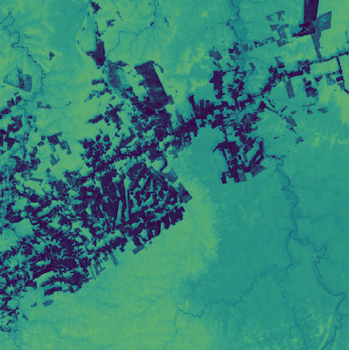

# Forest Carbon Diligence Sandbox Data
<!---
TODO: add links
-->

The Forest Carbon Diligence product consists of a bundle of data resources: Canopy Height, Canopy Cover, and Aboveground Live Carbon with a spatial resolution of 30 m. These data are collected annually over the entire land mass of the Earth (between 75° N and 60° S).

A collection of Forest Carbon Diligence for a limited area and time of interest is available with the CC-BY-SA license.

<!---
TODO: add BYOC collection IDs
-->
## Collections
<table>
  <thead>
    <tr>
      <th>Source ID</th>
      <th>Collection ID</th>
      <th>Time Range</th>
    </tr>
  </thead>
  <tbody>
    <tr>
      <td>CANOPY_HEIGHT_v1.0.0_30</td>
      <td>BYOC-xxx</td>
      <td>2013-01-01 - 2017-12-31</td>
    </tr>
    <tr>
      <td>CANOPY_COVER_v1.0.0_30</td>
      <td>BYOC-xxx</td>
      <td>2013-01-01 - 2017-12-31</td>
    </tr>
    <tr>
      <td>ABOVEGROUND_CARBON_DENSITY_v1.0.0_30</td>
      <td>BYOC-xxx</td>
      <td>2013-01-01 - 2017-12-31</td>
    </tr>
   </tbody>
</table>

## Sandbox Areas
To access data over your own areas and times of interest, [contact Planet](https://www.planet.com/contact-sales/#contact-sales).
  
*Insert map here*
  
[Download GeoJSONs]()

## EO Browser highlights
3 area samples are available as EO Browser Highlight Visualisations.
 

    

        
        

            
Bordeaux, France

            

                2013-01-01 - 2017-12-31 
                625km2
            

            
Visualise in EO Browser ->

        

    

    

        
        

            
SaoFeliz do Xingu, Brazil

            

                2013-01-01 - 2017-12-31 
                625km2
            

            
Visualise in EO Browser ->

        

    

    

        
        

            
Des Moines, USA

            

                2013-01-01 - 2017-12-31 
                625km2
            

            
Visualise in EO Browser ->

        

    

 
<!---
TODO: add link
-->

Discover more [Planet Sandbox Data collections]().
