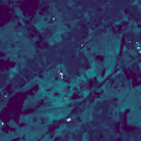
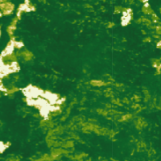
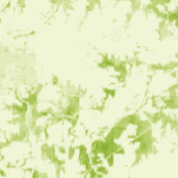

# Forest Carbon Diligence Sandbox Data

This sandbox collection of [Forest Carbon Diligence](../forest-carbon-diligence/) offers a limited area and time of interest. Only Planet accounts and Sentinel Hub accounts with a paid subscription have access under the [CC-BY-NC license](https://creativecommons.org/licenses/by-nc/4.0/).

## Collections

<table>
  <thead>
    <tr>
      <th>Source ID</th>
      <th>Collection ID</th>
      <th>Time Range</th>
    </tr>
  </thead>
  <tbody>
    <tr>
      <td>CANOPY_HEIGHT_v1.1.0_30</td>
      <td>BYOC-f3312c82-edea-42a1-8c9d-ada86ddcc857</td>
      <td>2013-01-01 - 2017-12-31</td>
    </tr>
    <tr>
      <td>CANOPY_COVER_v1.1.0_30</td>
      <td>BYOC-e3d2a21c-cb75-4311-86ac-024385c85b9c</td>
      <td>2013-01-01 - 2017-12-31</td>
    </tr>
    <tr>
      <td>ABOVEGROUND_CARBON_DENSITY_v1.1.0_30</td>
      <td>BYOC-cc31cada-80d8-46fe-a746-43ac2f87b5da</td>
      <td>2013-01-01 - 2017-12-31</td>
    </tr>
   </tbody>
</table>

## Sandbox Areas

_Insert map here_

<a href="../forest-carbon-diligence/polygons.geojson" download>Download GeoJSONs</a>

 

To purchase data over your own areas and times of interest, [contact Planet](https://www.planet.com/contact-sales/#contact-sales).

## EO Browser highlights

3 area samples are available as EO Browser Highlight Visualisations.
 

    

        
        

            
Bordeaux, France

            

                2013-01-01 - 2017-01-01 
                599km2
            

            
<a href="https://sentinelshare.page.link/Dwu8">Visualise in EO Browser -></a>

        

    

    

        
        

            
São Félix do Xingu, Brazil

            

                2013-01-01 - 2017-01-01 
                568km2
            

            
<a href="https://sentinelshare.page.link/XN9P">Visualise in EO Browser -></a>

        

    

    

        
        

            
Des Moines, USA

            

                2013-01-01 - 2017-01-31 
                581km2
            

            
<a href="https://sentinelshare.page.link/RTKM">Visualise in EO Browser -></a>

        

    

 
<!---
TODO: add link
-->

Discover more [Planet Sandbox Data collections](../planet-sandbox-data/).
