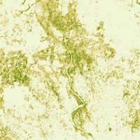

## Forest Carbon Monitoring Sandbox Data

This sandbox collection of <a href="../forest-carbon-monitoring/">Forest Carbon Monitoring</a> offers a limited area and time of interest. Only Planet users and Sentinel Hub users with a paid subscription have access under the <a href="https://creativecommons.org/licenses/by-nc/4.0/" target="_blank">CC-BY-NC license</a>.

### Collections

<table>
  <thead>
    <tr>
      <th>Source ID</th>
      <th>Collection Name</th>
      <th>Collection ID</th>
      <th>Time Range</th>
    </tr>
  </thead>
  <tbody>
    <tr>
      <td>CANOPY_HEIGHT_v1.0.0_3</td>
      <td>Planet Sandbox Data - PV FCM Canopy Height</td>
      <td>BYOC-d09d8fd8-a3b3-49fb-9d78-47f3a5cc8ecc</td>
      <td>2020-12-31 - 2023-12-20</td>
    </tr>
    <tr>
      <td>CANOPY_COVER_v1.0.0_3</td>
      <td>Planet Sandbox Data - PV FCM Canopy Cover</td>
      <td>BYOC-ca501757-cf8e-43a8-b1a4-1aa59ae22425</td>
      <td>2020-12-31 - 2023-12-20</td>
    </tr>
    <tr>
      <td>ABOVEGROUND_CARBON_DENSITY_v1.0.0_3</td>
      <td>Planet Sandbox Data - PV FCM Aboveground Carbon</td>
      <td>BYOC-d4a2a179-0c1a-4426-8d54-e2ac82830e83</td>
      <td>2020-12-31 - 2023-12-20</td>
    </tr>
   </tbody>
</table>

### Sandbox Areas

*Insert map here*

<a href="../forest-carbon-monitoring/polygons.geojson" download>Download GeoJSONs</a>

 
 

To purchase data over your own areas and times of interest, <a href="https://www.planet.com/contact-sales/" target="_blank">contact Planet</a>. 

### EO Browser highlights

3 area samples are available as EO Browser Highlight Visualisations.
 

    

    
        

            
Khammouane, Laos

            

                2020-12-21 - 2023-09-21 
                20km2
            

            
<a href='https://apps.sentinel-hub.com/eo-browser/?zoom=14&lat=17.1481&lng=105.82251&themeId=PLANET_SANDBOX&visualizationUrl=U2FsdGVkX1%2Fa%2Bw4wG8eIVfMgk%2FvDmhHxrovEwT%2FEvdBTkh4WvmXCd68%2Fq06VUwKIkmD5TMpuNJSzHZ6vxk3aqMvRO%2FyXNDbNLXZoCl0eD8yclCUNEhnG53w9KwWdSo%2Fe&datasetId=d4a2a179-0c1a-4426-8d54-e2ac82830e83&fromTime=2023-09-21T00%3A00%3A00.000Z&toTime=2023-09-21T23%3A59%3A59.999Z&layerId=ABOVEGROUND-CARBON-DENSITY&demSource3D="MAPZEN"' target="_blank">Visualise in EO Browser -></a>

        

    

    

        
        

            
Atsimo-Andrefana, Madagascar

            

                2020-12-21 - 2023-09-21 
                26km2
            

            
<a href='https://apps.sentinel-hub.com/eo-browser/?zoom=14&lat=-22.2323&lng=43.78691&themeId=PLANET_SANDBOX&visualizationUrl=U2FsdGVkX180XBAZynT8rOzF%2BQ44Xiaw0jjWE8kZ4I4pmiR8Z9sTnzKRpS3xqSik8pvp2FciGQyx1D8A9ooKBbyeflbMS55w3D%2FaBiRog85G13XWTnBALO%2BDzwYhV60n&datasetId=ca501757-cf8e-43a8-b1a4-1aa59ae22425&fromTime=2023-09-21T00%3A00%3A00.000Z&toTime=2023-09-21T23%3A59%3A59.999Z&layerId=CANOPY-COVER&demSource3D="MAPZEN"' target="_blank">Visualise in EO Browser -></a>

        

    

    

    
        

            
Idaho, USA

            

                2020-12-21 - 2023-09-21 
                20km2
            

            
<a href='https://apps.sentinel-hub.com/eo-browser/?zoom=13&lat=47.70965&lng=-116.34633&themeId=PLANET_SANDBOX&visualizationUrl=U2FsdGVkX1%2B8RQf7awJj1vqgAQjivr9mg3%2FjJskyAAugtAOVN9ARX24T1EVtjuDj5K2e2IIUVW6%2FNtCZBQPVqsaPDbZYlF4cFwsfsmNnc7W94%2BF7ISJa8ivVLR7aFFsM&datasetId=d09d8fd8-a3b3-49fb-9d78-47f3a5cc8ecc&fromTime=2023-09-21T00%3A00%3A00.000Z&toTime=2023-09-21T23%3A59%3A59.999Z&layerId=CANOPY-HEIGHT&demSource3D="MAPZEN"' target="_blank">Visualise in EO Browser -></a>

        

    

 
Discover more <a href="../planet-sandbox-data/">Planet Sandbox Data collections</a>
