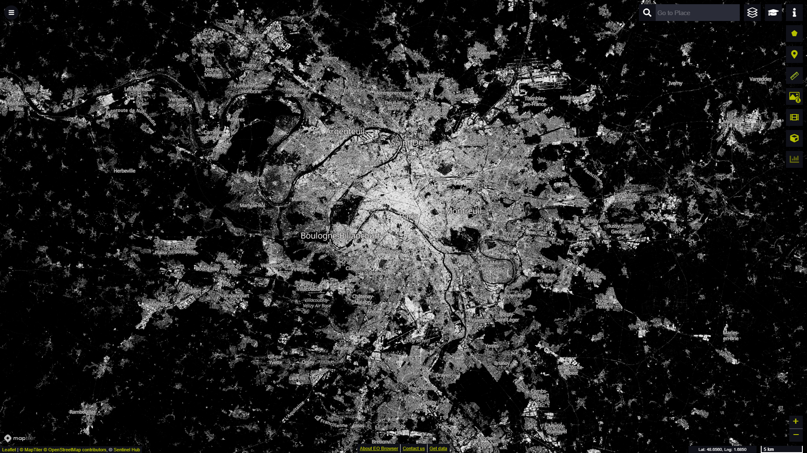
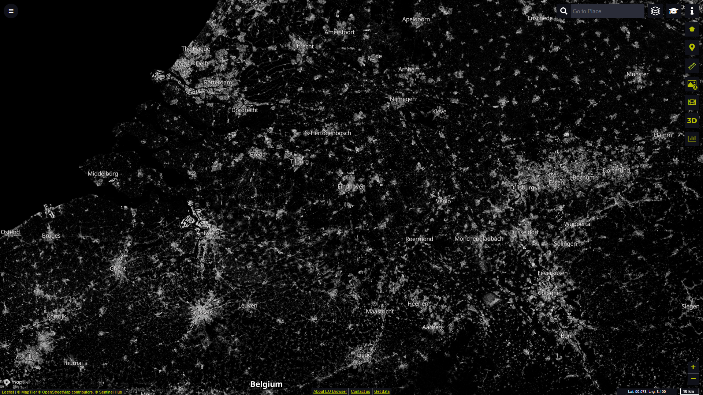

# Global Human Settlement Layer - GHS_BUILT_S2

## Short description

The Global Human Settlement (GHS) framework produces global maps of built-up, population density and settlements to monitor human presence on Earth over time. The data are managed by the Joint Research Centre (JRC) and the DG for Regional and Urban Policy (DG REGIO) of the European Commission, together with the international partnership GEO Human Planet Initiative of the GEO Human Planet Initiative.  
The Global Human Settlement Layer *GHS-BUILT-S2* is a global map of built-up areas (expressed as probabilities from 0 to 100 %) at 10 m spatial resolution. It was derived from a Sentinel-2 global image composite for the reference year 2018 using Convolutional Neural Networks.

Note: the currently available data is in an advanced but preliminary state. Possible gaps and inconsistencies will be fixed in a final quality control process.

## Band information

Built-up probability values rescaled in the range 0-100 (0 for probability = 0 and 100 for probability = 1); 255 = nodata

## More information

- [Official website](https://ghsl.jrc.ec.europa.eu/index.php)
- [Data source](https://ghsl.jrc.ec.europa.eu/download.php?ds=buS2)
- [Scientific publication on the dataset generation](https://link.springer.com/article/10.1007/s00521-020-05449-7)
- [Global Human Settlement Layer - Understanding Human Presence on Planet Earth (booklet)](https://ghsl.jrc.ec.europa.eu/documents/GHSL_Brochure.pdf?t=1639151473)

 

*Global Human Settlement Layer built-up probabilities over Paris (France) visualised in EO Browser*

 

*Global Human Settlement Layer built-up probabilities over parts of Germany, Netherlands and Belgium visualised in EO Browser*
