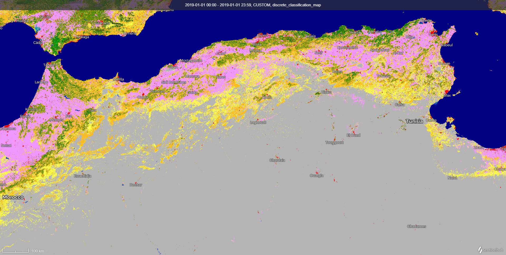

# Global Land Cover

## Short description
Global Land Cover products at 100 m resolution are delivered annually by [the global component of the Copernicus Land Service](https://land.copernicus.eu/global/products/lc).  

The most recent collection 3 (version 3.0.1) of 100 m Land Cover products for the years 2015 - 2019 were generated from the PROBA-V 100 m and 300 m satellite observations and several other ancillary datasets with global coverage. As from 2020, (2019-conso and 2020-nrt products) are planned to be generated from the combination of Sentinel-1 and Sentinel-2 satellite observations following end of PROBA-V operations.  
   
These Land Cover products provide a main discrete land cover classification map according to UN-FAO Land Cover Classification System [LCCS](http://www.fao.org/3/x0596e/x0596e00.htm). Additional continuous  fractional layers for all basic land cover classes which give the percentage of a 100 m pixel that is filled with a specific land cover class, are also included in the Land Cover products to provide more detailed information on each land cover class.  

## Update frequency

A new product is generated annually using an 'epoch', where an epoch consists of 3 years input data (one year before and  one year after the reference year) in three processing modes. 
- **base** maps for epoch 2015, that serves as reference for the classifier and regression models,
- **consolidated** maps (2016, 2017, 2018) one year before and one year after the reference year
-  **near-real time** maps (2019) with one year before and only three months data of the reference year. 

See [Product User Manual](https://land.copernicus.eu/global/sites/cgls.vito.be/files/products/CGLOPS1_PUM_LC100m-V3_I3.4.pdf) for more details on the procesing modes.

## Temporal availability
The following epochs are available:

| Epoch year  |  Product generation mode |
|---|---|
|2015|base|
|2016|consolidated|
|2017|consolidated|
|2018|consolidated|
|2019|near real time|

## Band information

The available bands include: a main discrete classification with 23 classes aligned with UN-FAO's Land Cover Classification System, a discrete classification probability map, fractional cover maps for the 10 main classes, a forest type layer, quality layer on input data density and on the confidence of the detected land cover change (only delivered for maps produced in conso or nrt mode)    
Reference: [Product User Manual](https://land.copernicus.eu/global/sites/cgls.vito.be/files/products/CGLOPS1_PUM_LC100m-V3_I3.4.pdf)

**Table 1: Bands** 

<table>
  <thead>
    <tr>
      <th>Name</th>
      <th>Units</th>
      <th>Values</th>
	    <th>Description</th>
    </tr>
  </thead>
  <tbody>
    <tr>
      <td>Discrete_Classification_map </td>
      <td > </td>
      <td>0 - 200</td>
	    <td> main discrete land cover classification according to FAO LCCS scheme </td>
    </tr>
    <tr>
      <td>Discrete_Classification_proba</td>
      <td > % </td>
      <td>0 - 100</td>
	    <td> Classification probability, a quality indicator for the discrete classification</td>
    </tr>
    <tr>
      <td>Forest_Type_layer</td>
      <td > </td>
      <td>0 - 5 </td>
      <td>Forest type for all pixels where tree cover fraction is bigger than 1 %</td>
    </tr>
    <tr>
      <td>Bare_CoverFraction_layer</td>
      <td > %</td>
      <td >0 - 100</td>
      <td> Fractional cover (%) for the bare and sparse vegetation class</td>
    </tr>
    <tr>
      <td>Crops_CoverFraction_layer</td>
      <td >% </td>
      <td>0 - 100</td>
	    <td> Fractional cover (%) for the cropland class</td>
    </tr>
    <tr>
      <td>Grass_CoverFraction_layer</td>
      <td >% </td>
      <td>0 - 100</td>
	    <td> Fractional cover (%) for the herbaceous vegetation class</td>
    </tr>
    <tr>
      <td>MossLichen_CoverFraction_layer</td>
      <td > %</td>
      <td>0 - 100 </td>
	    <td> Fractional cover (%) for the moss & lichen class</td>
    </tr>
    <tr>
      <td>Shrub_CoverFraction_layer</td>
      <td > % </td>
      <td>0 - 100</td>
      <td> Fractional cover (%) for the shrubland class</td>
    </tr>
    <tr>
      <td>Snow_CoverFraction_layer</td>
      <td > %</td>
      <td>0 - 100</td>
	    <td> Fractional cover (%) for the snow & ice class</td>
    </tr>
    <tr>
      <td>Tree_CoverFraction_layer</td>
      <td > %</td>
      <td>0 - 100</td>
	    <td> Fractional cover (%) for the forest class</td>
    </tr>
    <tr>
      <td>BuiltUp_CoverFraction_layer</td>
      <td >% </td>
      <td>0 - 100</td>
	    <td> Fractional cover (%) for the built-up class</td>
    </tr>
    <tr>
      <td>PermanentWater_CoverFraction_layer</td>
      <td > %</td>
      <td>0 - 100</td>
	    <td> Fractional cover (%) for the permanent inland water bodies class</td>
    </tr>
    <tr>
      <td>SeasonalWater_CoverFraction_layer</td>
      <td >% </td>
      <td>0 - 100</td>
	    <td> Fractional cover (%) for the seasonal inland water bodies class</td>
    </tr>
    <tr>
      <td>DataDensityIndicator</td>
      <td > </td>
      <td>0 - 100</td>
	    <td> Data density indicator showing quality of the EO input data  (0 = bad, 100 = perfect data)</td>
    </tr>
    <tr>
      <td>Change_Confidence_layer</td>
      <td > </td>
      <td>0 - 3</td>
	    <td> Quality layer regarding the change detection of the current mapped year to the previous mapped year. It is a 3 level confidence mask for all CONSO and NRT maps with value definitions as:
        <ul>
          <li>0 = No change.</li>
          <li>1 - Potential confidence.</li>
          <li>2 - Medium confidence.</li>
          <li>3 = High confidence.</li>
        </ul>
        NOTE: The values of Change_Confidence_layer band in 2015 data are not shown correctly, therefore this band in 2015 data should not be used.
      </td>
    </tr>
    
  </tbody>
</table>  

**Table 2: Discrete_Classsification_map  classes**  

A visualisation script can be found in our [custom scripts repository](https://custom-scripts.sentinel-hub.com/copernicus_services/global-land-cover/).

<table>
  <thead>
    <tr>
      <th>Value</th>
      <th>Color</th>
      <th>Color Code</th>
	    <th>Label</th>
    </tr>
  </thead>
  <tbody>
    <tr>
      <td>0 </td>
      <td style="background-color:#282828"></td>
	    <td> 0x282828 </td>
	    <td> No input data available </td>
    </tr>
    <tr>
      <td>20</td>
      <td style="background-color:#ffbb22"></td>
	    <td>0xffbb22 </td>
	    <td> Shrubs </td>
    </tr>
    <tr>
      <td>30</td>
      <td style="background-color:#ffff4c"></td>
	    <td> 0xffff4c </td>
	    <td> Herbaceous vegetation </td>
    </tr>
    <tr>
      <td>40</td>
      <td style="background-color:#f096ff" ></td>
	    <td> 0xf096ff  </td>
	    <td> Cultivated and managed vegetation/agriculture (cropland) </td>
    </tr>
    <tr>
      <td>50</td>
      <td style="background-color:#fa0000" ></td>
	    <td> 0xfa0000 </td>
	    <td> Urban / built up </td>
    </tr>
    <tr>
      <td>60</td>
      <td style="background-color:#b4b4b4"></td>
	    <td> 0xb4b4b4 </td>
	    <td> Bare / sparse vegetation </td>
    </tr>  
    <tr>
      <td>70</td>
      <td style="background-color:#f0f0f0"></td>
	    <td> 0xf0f0f0 </td>
	    <td> Snow and Ice </td>
    </tr> 
    <tr>
      <td>80</td>
      <td style="background-color:#0032c8"></td>
	    <td> 0x0032c8  </td>
	    <td> Permanent water bodies </td>
    </tr> 
    <tr>
      <td>90</td>
      <td style="background-color:#0096a0"></td>
	    <td> 0x0096a0 </td>
	    <td> Herbaceous wetland </td>
    </tr>
    <tr>
      <td>100</td>
      <td style="background-color:#fae6a0"></td>
	    <td> 0xfae6a0 </td>
	    <td> Moss and lichen </td>
    </tr>
    <tr>
      <td>111</td>
      <td style="background-color:#58481f"></td>
	    <td> 0x58481f </td>
	    <td> Closed forest, evergreen needle leaf </td>
    </tr>
    <tr>
      <td>112</td>
      <td style="background-color:#009900"></td>
	    <td> 0x009900 </td>
	    <td> Closed forest, evergreen, broad leaf </td>
    </tr>
    <tr>
      <td>113</td>
      <td style="background-color:#70663e"></td>
	    <td> 0x70663e </td>
	    <td> Closed forest, deciduous needle leaf </td>
    </tr>
    <tr>
      <td>114</td>
      <td style="background-color:#00cc00"></td>
	    <td> 0x00cc00 </td>
	    <td> Closed forest, deciduous broad leaf </td>
    </tr>
    <tr>
      <td>115</td>
      <td style="background-color:#4e751f"></td>
	    <td> 0x4e751f </td>
	    <td> Closed forest, mixed </td>
    </tr>
    <tr>
      <td>116</td>
      <td style="background-color:#007800"></td>
	    <td> 0x007800 </td>
	    <td> Closed forest, unknown </td>
    </tr>
    <tr>
      <td>121</td>
      <td style="background-color:#666000"></td>
	    <td> 0x666000 </td>
	    <td> Open forest, evergreen needle leaf </td>
    </tr>
    <tr>
      <td>122</td>
      <td style="background-color:#8db400"></td>
	    <td> 0x8db400 </td>
	    <td> Open forest, evergreen broad leaf </td>
    </tr>
    <tr>
      <td>123</td>
      <td style="background-color:#8d7400"></td>
	    <td> 0x8d7400 </td>
	    <td> Open forest, deciduous needle leaf </td>
    </tr>
    <tr>
      <td>124</td>
      <td style="background-color:#a0dc00"></td>
	    <td> 0xa0dc00 </td>
	    <td> Open forest, deciduous broad leaf </td>
    </tr>
      <tr>
      <td>125</td>
      <td style="background-color:#929900"></td>
	    <td> 0x929900 </td>
	    <td> Open forest, mixed </td>
    </tr>
    <tr>
      <td>126</td>
      <td style="background-color:#648c00"></td>
	    <td> 0x648c00 </td>
	    <td> Open forest, unknown </td>
    </tr>
    <tr>
      <td>200</td>
      <td style="background-color:#000080"></td>
	    <td> 0x000080 </td>
	    <td> Open sea </td>
    </tr>
    <tr>
      <td>255</td>
      <td></td>
	    <td>  </td>
	    <td> No data </td>
    </tr>
  </tbody>
</table>  

**Table 3: Forest_Type_Layer classes**

<table>
  <thead>
    <tr>
      <th>Value</th>
	    <th>Label</th>
    </tr>
  </thead>
  <tbody>
    <tr>
      <td>0 </td>
	    <td> Unknown, doesn’t match any of the other types </td>
    </tr>
    <tr>
      <td>1</td>
	    <td> Evergreen needle leaf </td>
    </tr>
    <tr>
      <td>2</td>
	    <td> Evergreen broad leaf </td>
    </tr>
    <tr>
      <td>3</td>
	    <td> Deciduous needle leaf </td>
    </tr>
    <tr>
      <td>4</td>
	    <td> Deciduous broad leaf </td>
    </tr>
    <tr>
      <td>5</td>
	    <td> Mix of forest type </td>
    </tr>  
    <tr>
      <td>255</td>
	    <td> No data </td>
    </tr> 
    
  </tbody>
</table>

## More information
- [Global Land Cover viewer for maps and area statistics](https://lcviewer.vito.be/2015)
- [Data source](https://lcviewer.vito.be/download)
- [Product User Manual](https://land.copernicus.eu/global/sites/cgls.vito.be/files/products/CGLOPS1_PUM_LC100m-V3_I3.4.pdf)

*2019 nrt discrete land cover classification map for parts of North Africa visualised in EO browser*

*2019 nrt forest type Map over Dominican Republic and Haiti visualised in EO browser*

