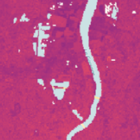
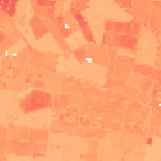

## Land Surface Temperature Sandbox Data

This Sandbox collection of <a href="../land-surface-temperature/">Land Surface Temperature</a> offers a limited area and time of interest. Only Planet users and Sentinel Hub users with a paid subscription have access under the <a href="https://creativecommons.org/licenses/by-nc/4.0/" target="_blank">CC-BY-NC license</a>.

### Collections

<table>
  <thead>
    <tr>
      <th>Source ID</th>
      <th>Collection Name</th>
      <th>Collection ID</th>
      <th>Time Range</th>
    </tr>
  </thead>
  <tbody>
    <tr>
      <td>LST-AMSR2_V1.0_100</td>
      <td>Planet Sandbox Data - PV LST 100m</td>
      <td>BYOC-8d977093-cf9e-4351-8159-90f2522c29c1</td>
      <td>2017-07-01 - 2022-12-31</td>
    </tr>
    <tr>
      <td>LST-AMSR2_V1.0_1000</td>
      <td>Planet Sandbox Data - PV LST 1km</td>
      <td>BYOC-6b613b07-410a-4312-93ad-d1751fdc55de</td>
      <td>2013-01-01 - 2022-12-31</td>
    </tr>
   </tbody>
</table>

### Sandbox Areas
*Insert map here*

<a href="../land-surface-temperature/polygons.geojson" download>Download GeoJSONs</a>

 

To purchase data over your own areas and times of interest, <a href="https://www.planet.com/contact-sales/#contact-sales)" target="_blank">contact Planet</a>. 

### EO Browser highlights
3 area samples are available as EO Browser Highlight Visualisations.
 

    

    
        

            
Bordeaux, France

            

                2017-07-01 to 2023-04-30 
                2460km2
            

            
<a href='https://apps.sentinel-hub.com/eo-browser/?zoom=11&lat=44.84&lng=-0.5234&themeId=PLANET_SANDBOX&visualizationUrl=https%3A%2F%2Fservices.sentinel-hub.com%2Fogc%2Fwms%2Fe5216a19-bd01-45bd-9c90-f19cc1971e5d&datasetId=8d977093-cf9e-4351-8159-90f2522c29c1&fromTime=2023-04-30T00%3A00%3A00.000Z&toTime=2023-04-30T23%3A59%3A59.999Z&layerId=LST-100&demSource3D="MAPZEN"' target="_blank">Visualise in EO Browser -></a>

        

    

    

    
        

            
Griffith, Australia

            

                2017-07-01 to 2022-12-31 
                593km2
            

            
<a href='https://apps.sentinel-hub.com/eo-browser/?zoom=12&lat=-34.5218&lng=146.1202&themeId=PLANET_SANDBOX&visualizationUrl=https%3A%2F%2Fservices.sentinel-hub.com%2Fogc%2Fwms%2Fe5216a19-bd01-45bd-9c90-f19cc1971e5d&datasetId=8d977093-cf9e-4351-8159-90f2522c29c1&fromTime=2022-12-27T00%3A00%3A00.000Z&toTime=2022-12-27T23%3A59%3A59.999Z&layerId=LST-100&demSource3D="MAPZEN"' target="_blank">Visualise in EO Browser -></a>

        

    

    

    
        

            
Des Moines, United States

            

                2017-07-01 to 2022-12-31 
                2373km2
            

            
<a href='https://apps.sentinel-hub.com/eo-browser/?zoom=11&lat=41.191&lng=-93.818&themeId=PLANET_SANDBOX&visualizationUrl=https%3A%2F%2Fservices.sentinel-hub.com%2Fogc%2Fwms%2Fe5216a19-bd01-45bd-9c90-f19cc1971e5d&datasetId=8d977093-cf9e-4351-8159-90f2522c29c1&fromTime=2022-12-31T00%3A00%3A00.000Z&toTime=2022-12-31T23%3A59%3A59.999Z&layerId=LST-100&demSource3D="MAPZEN"' target="_blank">Visualise in EO Browser -></a>

        

    

 

Discover more <a href="../planet-sandbox-data/">Planet Sandbox Data collections</a>