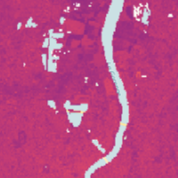
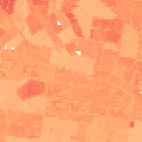

# Land Surface Temperature Sandbox Data
<!---
TODO: add links
-->

This sandbox collection of Land Surface Temperature offers a limited area and time of interest. Only Planet accounts and Sentinel Hub accounts with a paid subscription have access under the CC-BY-NC license.

## Collections

<table>
  <thead>
    <tr>
      <th>Source ID</th>
      <th>Collection ID</th>
      <th>Time Range</th>
    </tr>
  </thead>
  <tbody>
    <tr>
      <td>LST-AMSR2_V1.0_100</td>
      <td>BYOC-8d977093-cf9e-4351-8159-90f2522c29c1</td>
      <td>2002-06-15 - 2022-12-31</td>
    </tr>
    <tr>
      <td>LST-AMSR2_V1.0_1000</td>
      <td>BYOC-6b613b07-410a-4312-93ad-d1751fdc55de</td>
      <td>2002-06-15 - 2022-12-31</td>
    </tr>
   </tbody>
</table>

## Sandbox Areas
To access data over your own areas and times of interest, [contact Planet](https://www.planet.com/contact-sales/#contact-sales).
 
*Insert map here*
 
[Download GeoJSONs]()

## EO Browser highlights
3 area samples are available as EO Browser Highlight Visualisations.
 

    

        
        

            
Bordeaux, France

            

                2022-05-01 to 2023-04-30 
                25km2
            

            
Visualise in EO Browser ->

        

    

    

        
        

            
Griffith, Australia

            

                2022-05-01 to 2023-04-30 
                25km2
            

            
Visualise in EO Browser ->

        

    

    

        
        

            
Des Moines, United States

            

                2022-05-01 to 2023-04-30 
                25km2
            

            
Visualise in EO Browser ->

        

    

 
<!---
TODO: add link
-->

Discover more [Planet Sandbox Data collections](../planet-sandbox-data/)