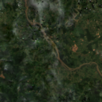
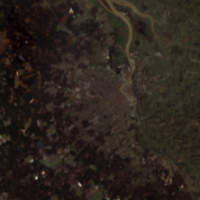
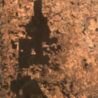

## Planet Basemaps Sandbox Data

This sandbox collection of <a href="../planet-basemaps/">Planet Basemaps</a> offers a limited area and time of interest. Only Planet accounts and Sentinel Hub accounts with a paid subscription have access under the <a href="https://creativecommons.org/licenses/by-nc/4.0/" target="_blank">CC-BY-NC license</a>.

### Collections
<table>
  <thead>
    <tr>
      <th>Source ID</th>
      <th>Collection Name</th>
      <th>Collection ID</th>
      <th>Time Range</th>
    </tr>
  </thead>
  <tbody>
    <tr>
      <td>ps_s2_normalized_sr_monthly_mosaic</td>
      <td>Planet Sandbox Data - Planet Monthly Basemaps </td>
      <td>BYOC-c48c018f-67a1-4827-a1e4-f3ab98690312</td>
      <td>2021-01-01 - 2023-04-01</td>
    </tr>
   </tbody>
</table>

### Sandbox Areas
*Insert map here*

<a href="../planet-basemaps/polygons.geojson" download>Download GeoJSONs</a>

 
 

To purchase data over your own areas and times of interest, <a href="https://www.planet.com/contact-sales/#contact-sales)" target="_blank">contact Planet</a>. 

### EO Browser highlights
3 area samples are available as EO Browser Highlight Visualisations.
 

    

    
        

            
São Félix do Xingu, Brazil

            

                2021-01-01 to 2023-04-01 
                27021km2
            

            
<a href='https://apps.sentinel-hub.com/eo-browser/?zoom=9&lat=-6.7652&lng=-52.3763&themeId=PLANET_SANDBOX&visualizationUrl=https%3A%2F%2Fservices.sentinel-hub.com%2Fogc%2Fwms%2F64e8174f-7d03-4863-ba70-5139e325a75d&datasetId=c48c018f-67a1-4827-a1e4-f3ab98690312&fromTime=2023-04-01T00%3A00%3A00.000Z&toTime=2023-04-01T23%3A59%3A59.999Z&layerId=TRUE-COLOR&demSource3D="MAPZEN"' target="_blank">Visualise in EO Browser -></a>

        

    

    

    
        

            
Bordeaux, France

            

                2021-01-01 to 2023-04-01 
                19181km2
            

            
<a href='https://apps.sentinel-hub.com/eo-browser/?zoom=9&lat=44.7345&lng=-0.676&themeId=PLANET_SANDBOX&visualizationUrl=https%3A%2F%2Fservices.sentinel-hub.com%2Fogc%2Fwms%2F64e8174f-7d03-4863-ba70-5139e325a75d&datasetId=c48c018f-67a1-4827-a1e4-f3ab98690312&fromTime=2023-04-01T00%3A00%3A00.000Z&toTime=2023-04-01T23%3A59%3A59.999Z&layerId=TRUE-COLOR&demSource3D="MAPZEN"' target="_blank">Visualise in EO Browser -></a>

        

    

    

    
        

            
Perth, Australia

            

                2021-01-01 to 2023-04-01 
                29827km2
            

            
<a href='https://apps.sentinel-hub.com/eo-browser/?zoom=9&lat=-31.702&lng=116.524&themeId=PLANET_SANDBOX&visualizationUrl=https%3A%2F%2Fservices.sentinel-hub.com%2Fogc%2Fwms%2F64e8174f-7d03-4863-ba70-5139e325a75d&datasetId=c48c018f-67a1-4827-a1e4-f3ab98690312&fromTime=2023-04-01T00%3A00%3A00.000Z&toTime=2023-04-01T23%3A59%3A59.999Z&layerId=TRUE-COLOR&demSource3D="MAPZEN"' target="_blank">Visualise in EO Browser -></a>

        

    

 

Discover more <a href="../planet-sandbox-data/">Planet Sandbox Data collections</a>
