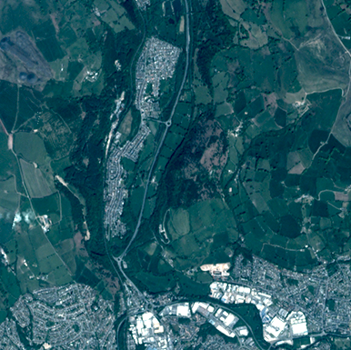

# PlanetScope Sandbox Data
<!---
TODO: add links
-->

<a href="https://www.planet.com/products/planet-imagery/PlanetScope">PlanetScope</a> is a satellite constellation of more than 130 satellites, called Doves, and is operated by Planet. Each Dove satellite is a CubeSat, which consists of three cubic units and is therefore only 10 cm x 10 cm x 30 cm in size. The satellites are launched in groups and together manage to capture images of the entire land surface of the Earth at least daily. Sentinel Hub offers the possibility to purchase, order and access both the archive data and newly acquired data available globally since 2016. Sentinel Hub provides access to PlantScope data in Top of the atmosphere (TOA) reflectance.

A collection of PlanetScope for a limited area and time of interest is available with the CC-BY-SA license.

## Collections
<table>
  <thead>
    <tr>
      <th>Source ID</th>
      <th>Collection ID</th>
      <th>Time Range</th>
    </tr>
  </thead>
  <tbody>
    <tr>
      <td>analytic_8b_sr_udm2</td>
      <td>BYOC-ccb1f8f0-e5bf-4c31-afe5-d8803bcbde2a</td>
      <td>2022-05-01 - 2023-04-30</td>
    </tr>
   </tbody>
</table>

## Sandbox Areas
To access data over your own areas and times of interest, [contact Planet](https://www.planet.com/contact-sales/#contact-sales).
 
*Insert map here*
 
[Download GeoJSONs]()

## EO Browser highlights
3 area samples are available as EO Browser Highlight Visualisations.
 

    

        
        

            
Planalmira, Brazil

            

                2022-05-01 to 2023-04-30 
                25km2 
                Visualise in EO Browser ->
            

        

    

    

        
        

            
Cairo, Egypt

            

                2022-05-01 to 2023-04-30 
                25km2 
                Visualise in EO Browser ->
            

        

    

    

        
        

            
Perth, Australia

            

                2022-05-01 to 2023-04-30 
                25km2 
                Visualise in EO Browser ->
            

        

    

 
<!---
TODO: add link
-->

Discover more [Planet Sandbox Data collections]().
