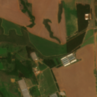
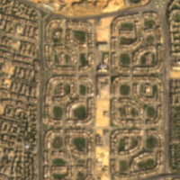
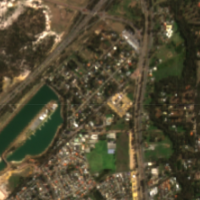

## PlanetScope Sandbox Data

This sandbox collection of <a href="../planetscope/">PlanetScope</a> offers a limited area and time of interest. Only Planet accounts and Sentinel Hub accounts with a paid subscription have access under the <a href="https://creativecommons.org/licenses/by-nc/4.0/" target="_blank">CC-BY-NC license</a>. 

### Collections
<table>
  <thead>
    <tr>
      <th>Source ID</th>
      <th>Collection Name</th>
      <th>Collection ID</th>
      <th>Time Range</th>
    </tr>
  </thead>
  <tbody>
    <tr>
      <td>analytic_8b_sr_udm2</td>
      <td>Planet Sandbox Data - PlanetScope</td>
      <td>BYOC-ccb1f8f0-e5bf-4c31-afe5-d8803bcbde2a</td>
      <td>2022-05-01 - 2023-04-30</td>
    </tr>
   </tbody>
</table>

### Sandbox Areas
*Insert map here*

<a href="../planetscope/polygons.geojson" download>Download GeoJSONs</a>

 

To purchase data over your own areas and times of interest, <a href="https://www.planet.com/contact-sales/#contact-sales)" target="_blank">contact Planet</a>. 

### EO Browser highlights
3 area samples are available as EO Browser Highlight Visualisations.
 

    

    
        

            
Planalmira, Brazil

            

                2022-05-01 to 2023-04-30 
                25km2
            

            
<a href='https://apps.sentinel-hub.com/eo-browser/?zoom=14&lat=-16.59673&lng=-48.78251&themeId=PLANET_SANDBOX&visualizationUrl=https%3A%2F%2Fservices.sentinel-hub.com%2Fogc%2Fwms%2F11ce5d8a-4ae8-4f99-923c-334073b747a1&datasetId=ccb1f8f0-e5bf-4c31-afe5-d8803bcbde2a&fromTime=2022-11-17T00%3A00%3A00.000Z&toTime=2022-11-17T23%3A59%3A59.999Z&layerId=TRUE-COLOR&demSource3D="MAPZEN"' target="_blank">Visualise in EO Browser -></a>

        

    

    

    
        

            
Cairo, Egypt

            

                2022-05-01 to 2023-04-30 
                25km2
            

            
<a href='https://apps.sentinel-hub.com/eo-browser/?zoom=14&lat=30.05862&lng=31.47&themeId=PLANET_SANDBOX&visualizationUrl=https%3A%2F%2Fservices.sentinel-hub.com%2Fogc%2Fwms%2F11ce5d8a-4ae8-4f99-923c-334073b747a1&datasetId=ccb1f8f0-e5bf-4c31-afe5-d8803bcbde2a&fromTime=2022-11-20T00%3A00%3A00.000Z&toTime=2022-11-20T23%3A59%3A59.999Z&layerId=TRUE-COLOR&demSource3D="MAPZEN"' target="_blank">Visualise in EO Browser -></a>

        

    

    

    
        

            
Perth, Australia

            

                2022-05-01 to 2023-04-30 
                25km2
            

            
<a href='https://apps.sentinel-hub.com/eo-browser/?zoom=14&lat=-32.1112&lng=116.0231&themeId=PLANET_SANDBOX&visualizationUrl=https%3A%2F%2Fservices.sentinel-hub.com%2Fogc%2Fwms%2F11ce5d8a-4ae8-4f99-923c-334073b747a1&datasetId=ccb1f8f0-e5bf-4c31-afe5-d8803bcbde2a&fromTime=2023-04-19T00%3A00%3A00.000Z&toTime=2023-04-19T23%3A59%3A59.999Z&layerId=TRUE-COLOR&demSource3D="MAPZEN"' target="_blank">Visualise in EO Browser -></a>

        

    

 

Discover more <a href="../planet-sandbox-data/">Planet Sandbox Data collections</a>
