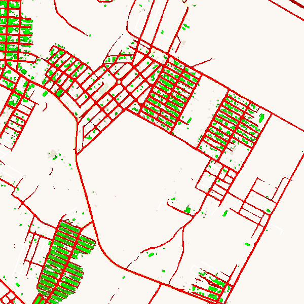
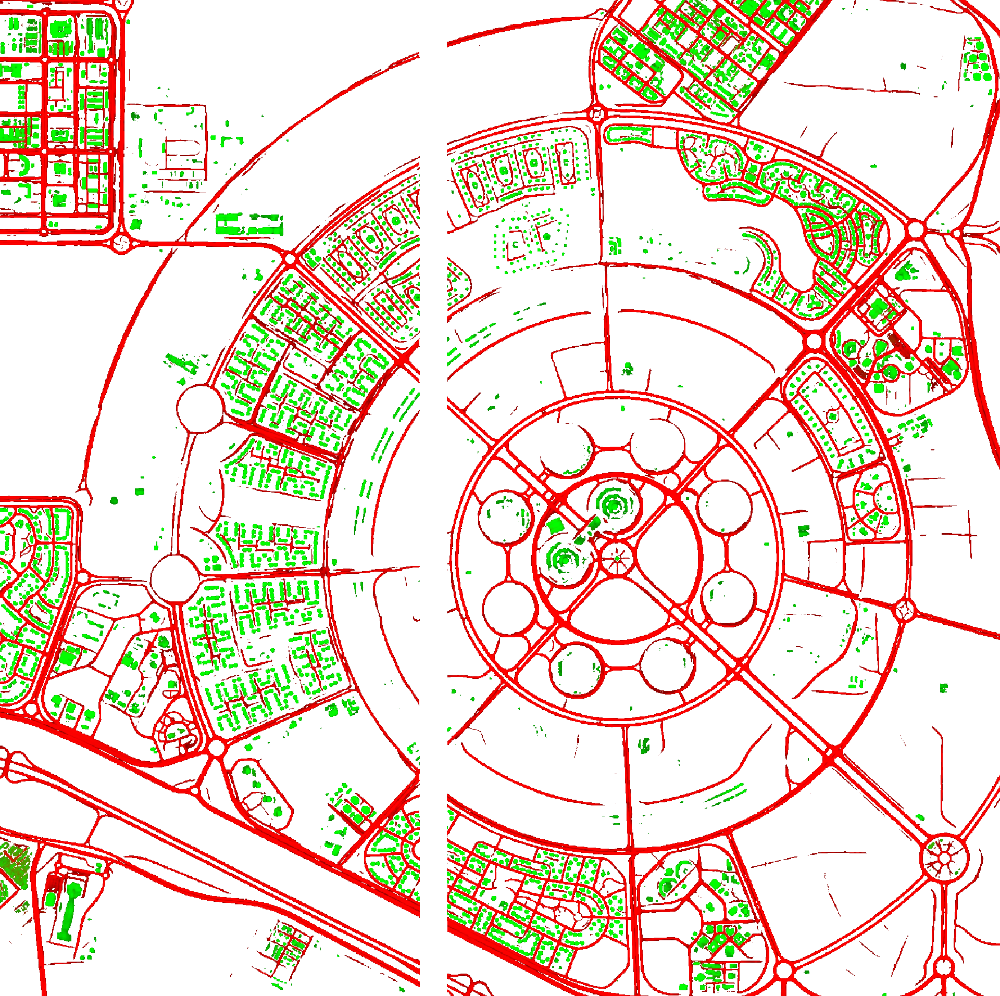
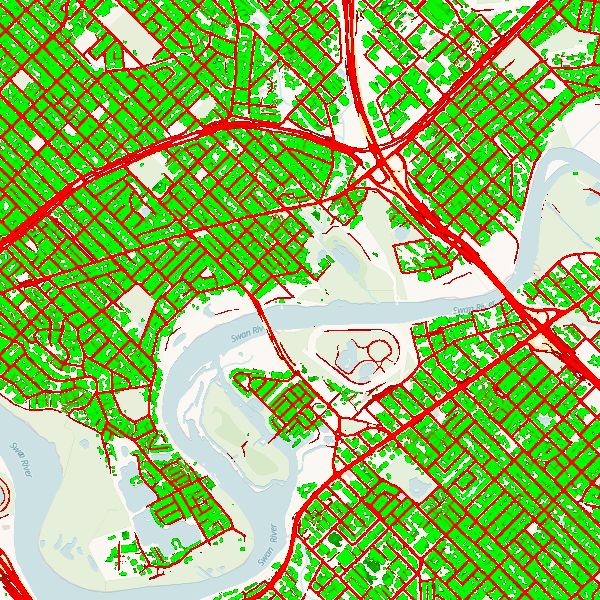

## Road and Building Detection Sandbox Data

This sandbox collection of <a href="../road-and-building-detection/"> Road and Building Detection</a> offers a limited area and time of interest. Only Planet accounts and Sentinel Hub accounts with a paid subscription have access under the <a href="https://creativecommons.org/licenses/by-nc/4.0/" target="_blank">CC-BY-NC license</a>.

### Collections

<table>
  <thead>
    <tr>
      <th>Source ID</th>
      <th>Collection Name</th>
      <th>Collection ID</th>
      <th>Time Range</th>
    </tr>
  </thead>
  <tbody>
    <tr>
      <td>rnb_weekly_v2</td>
      <td>Planet Sandbox Data - Planet Monthly Roads and Buildings </td>
      <td>BYOC-9ff30ab7-62c2-4d19-b5ef-83805c7e7602</td>
      <td>2021-01-01 - 2023-03-01</td>
    </tr>
   </tbody>
</table>

### Sandbox Areas

_Insert map here_

<a href="../road-and-building-detection/polygons.geojson" download>Download GeoJSONs</a>

 
 

To purchase data over your own areas and times of interest, <a href="https://www.planet.com/contact-sales/#contact-sales)" target="_blank">contact Planet</a>.

### EO Browser highlights

3 area samples are available as EO Browser Highlight Visualisations.
 

    

    
        

            
São Félix do Xingu, Brazil

            

                2021-01-01 to 2023-03-01 
                27020km2
            

            
<a href='https://apps.sentinel-hub.com/eo-browser/?zoom=14&lat=-6.64342&lng=-51.97589&themeId=PLANET_SANDBOX&visualizationUrl=https%3A%2F%2Fservices.sentinel-hub.com%2Fogc%2Fwms%2F655dfaa9-35e3-4fe1-a8e2-14e4c178f6b9&datasetId=9ff30ab7-62c2-4d19-b5ef-83805c7e7602&fromTime=2023-03-01T00%3A00%3A00.000Z&toTime=2023-03-01T23%3A59%3A59.999Z&layerId=0-ROADS-AND-BUILDINGS&demSource3D="MAPZEN"' target="_blank">Visualise in EO Browser -></a>

        

    

    

    
        

            
Cairo, Egypt

            

                2021-01-01 to 2023-03-01 
                13962km2
            

            
<a href='https://apps.sentinel-hub.com/eo-browser/?zoom=14&lat=29.94687&lng=31.63204&themeId=PLANET_SANDBOX&visualizationUrl=https%3A%2F%2Fservices.sentinel-hub.com%2Fogc%2Fwms%2F655dfaa9-35e3-4fe1-a8e2-14e4c178f6b9&datasetId=9ff30ab7-62c2-4d19-b5ef-83805c7e7602&fromTime=2023-03-01T00%3A00%3A00.000Z&toTime=2023-03-01T23%3A59%3A59.999Z&layerId=0-ROADS-AND-BUILDINGS&demSource3D="MAPZEN"' target="_blank">Visualise in EO Browser -></a>

        

    

    

    
        

            
Perth, Australia

            

                2021-01-01 to 2023-03-01 
                29827km2
            

            
<a href='https://apps.sentinel-hub.com/eo-browser/?zoom=14&lat=-31.94761&lng=115.86455&themeId=PLANET_SANDBOX&visualizationUrl=https%3A%2F%2Fservices.sentinel-hub.com%2Fogc%2Fwms%2F655dfaa9-35e3-4fe1-a8e2-14e4c178f6b9&datasetId=9ff30ab7-62c2-4d19-b5ef-83805c7e7602&fromTime=2023-03-01T00%3A00%3A00.000Z&toTime=2023-03-01T23%3A59%3A59.999Z&layerId=0-ROADS-AND-BUILDINGS&demSource3D="MAPZEN"' target="_blank">Visualise in EO Browser -></a>

        

    

 

Discover more <a href="../planet-sandbox-data/">Planet Sandbox Data collections</a>
