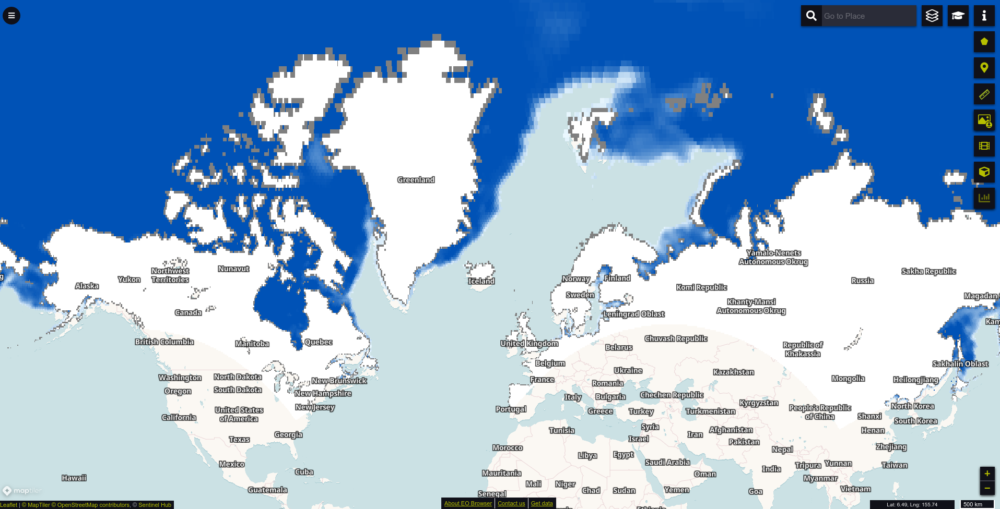
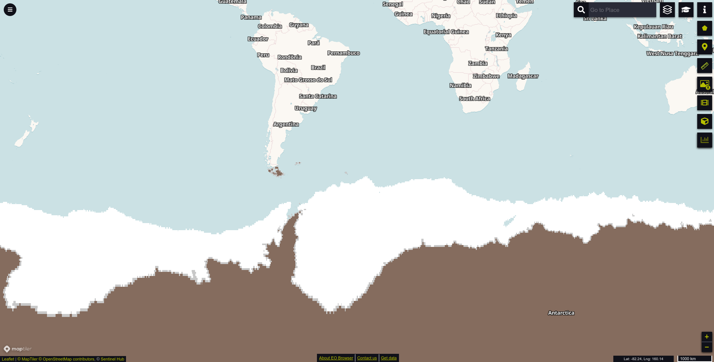

# Water Bodies 

## Short description

[Sea Ice Index](https://nsidc.org/data/G02135/versions/3) products offer information about ice cover and its trends in the Arctic and Antarctica.
   In this collection, sea ice extent and concentration maps are provided at a resolution of 25 km on a daily basis.
   The products are computed using images from the Special Sensor Microwave Imager (SSM/I) and 
   Special Sensor Microwave Imager/Sounder (SSMIS) instruments on Defense Meteorological Satellite Program (DMSP)
   satellites. Sea ice concentrations are generated from 
   [brightness temperature data](https://nsidc.org/data/nsidc-0051). Sea ice extent is computed as areas covered by ice
    with a concentration greater than 15 percent. This dataset is for demonstration purposes only and is not maintained.

## Band information

The sea ice index product contains 4 bands that are described in Table 1 below.  

 

**Table 1: Bands** 

<table class="tg">
<thead>
  <tr>
    <th class="tg-uzvj">Name</th>
    <th class="tg-wa1i">Values</th>
    <th class="tg-wa1i">Description</th>
  </tr>
</thead>
<tbody>
  <tr>
    <td class="tg-0lax">Concentration</td>
    <td class="tg-0lax">0-1000; 2540; 2530</td>
    <td class="tg-0lax">Sea ice concentration, includes land masses and coastlines. Sea ice concentration are expressed in percentage * 10. Land masses are assigned the value 2540. Coastlines are assigned the value 2530.</td>
  </tr>
  <tr>
    <td class="tg-0lax">Concentration ice</td>
    <td class="tg-0lax">0-1000</td>
    <td class="tg-0lax">Sea ice concentration. Values are expressed in percentage * 10.</td>
  </tr>
  <tr>
    <td class="tg-0lax">Extent</td>
    <td class="tg-0lax">0; 1; 253; 254</td>
    <td class="tg-0lax">Sea ice extent (binary), includes land masses and coastlines. Areas covered by ice are assigned the value 1. Land masses are assigned the value 254. Coastlines are assigned the value 253. </td>
  </tr>
  <tr>
    <td class="tg-0lax">Extent ice</td>
    <td class="tg-0lax">0;1</td>
    <td class="tg-0lax">Sea ice extent (binary).</td>
  </tr>
</tbody>
</table>

## More information
- [Data Source](https://nsidc.org/data/G02135/versions/3)
- [Product User Manual](https://nsidc.org/sites/nsidc.org/files/G02135-V003-UserGuide_1.pdf)

*Sea ice concentration in the northern hemisphere on 29th January 2021.*

*Sea ice extent in the southern hemisphere on 29th July 2020.*

