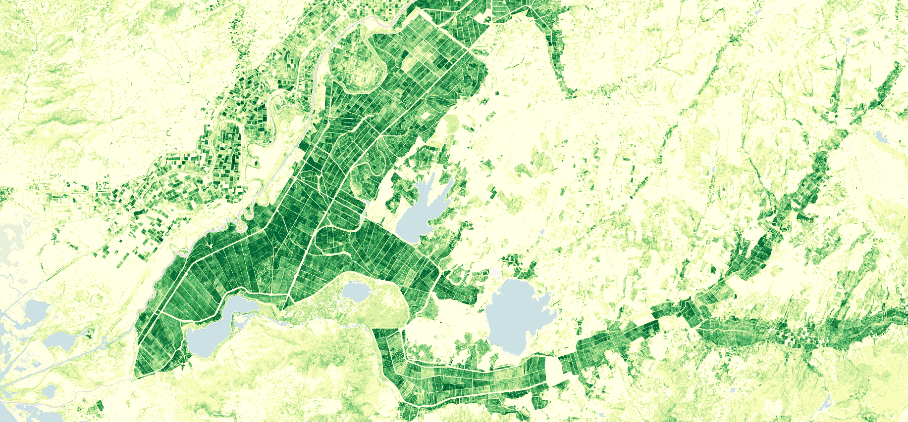
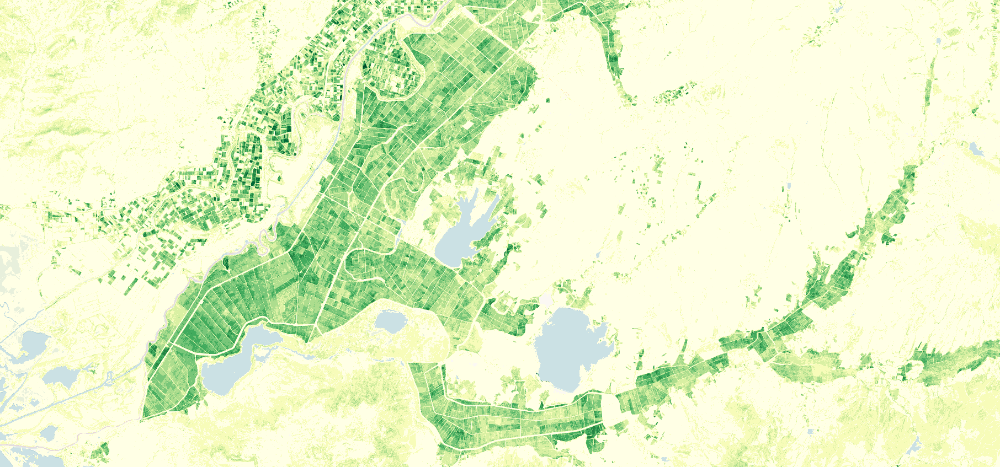

# Seasonal Trajectories, 10-daily

## Short description
Seasonal Trajectories (ST) product is a filtered time series of [Plant Phenology Index(PPI)](https://www.nateko.lu.se/research/remote-sensing-and-earth-observation/lund-earth-observation-research-group/vegetation-phenology) provided yearly on a 10-daily basis at 10m resolution . 
It is part of the Copernicus Land Monitoring Service (CLMS), pan-European High Resolution Vegetation Phenology and Productivity [(HR-VPP)](https://land.copernicus.eu/pan-european/biophysical-parameters/high-resolution-vegetation-phenology-and-productivity) product suite. 
The Seasonal Trajectories PPI is derived through fitting a smoothing and gap filling function to the yearly time-series raw PPI values generated from Sentinel-2 satellite observations. 
In addition to the PPI band, a QFLAG band  indicating the quality of the smoothing process is included. 
The Seasonal Trajectories provide the vegetation status for each pixel on a regular 10-day time step from January 1 2017 onwards over the  EEA39 region. 
More information about ST product is outlined in the [product user manual](https://land.copernicus.eu/user-corner/technical-library/product-user-manual-of-seasonal-trajectories/) 

## Band information
The available bands include: PPI and QFLAG  

### QFLAG

<table>
  <thead>
    <tr>
      <th>Value</th>
      <th>Quality</th>
      <th>Definition</th>
    </tr>
  </thead>
  <tbody>
    <tr>
      <td>5</td>
      <td >High </td>
      <td>More than 8 Clear-sky land observations found in a 91-day-window</td>
    </tr>
    <tr>
      <td>4</td>
      <td >medium </td>
      <td>3 to 8 Clear-sky land observations found in a 91-day-window</td>
    </tr>
    <tr>
      <td>3</td>
      <td >low </td>
      <td>1 to 2 Clear-sky land observations found in a 91-day-window</td>
    </tr>
    <tr>
      <td>2</td>
      <td >Filled (interpolation) </td>
      <td>Clear-sky land observation(s) found on both left and right sides but outside a 91-day-window</td>
    </tr>
    <tr>
      <td>1</td>
      <td >Filled (extrapolation) </td>
      <td>Clear-sky land observation found on one side (left or right) but outside a 91-day-window</td>
    </tr>
    <tr>
      <td>0</td>
      <td > Filled (extrapolation) </td>
      <td>The time series was not processed</td>
    </tr>
   </tbody>
</table>  

## More information

### Representative Images 

*Seasonal Trajectories PPI August 2019, Gala Lake and surroundings along Greece-Turkey border.*

 
 

*Seasonal Trajectories PPI September 2019, Gala Lake and surroundings along Greece-Turkey border.*
