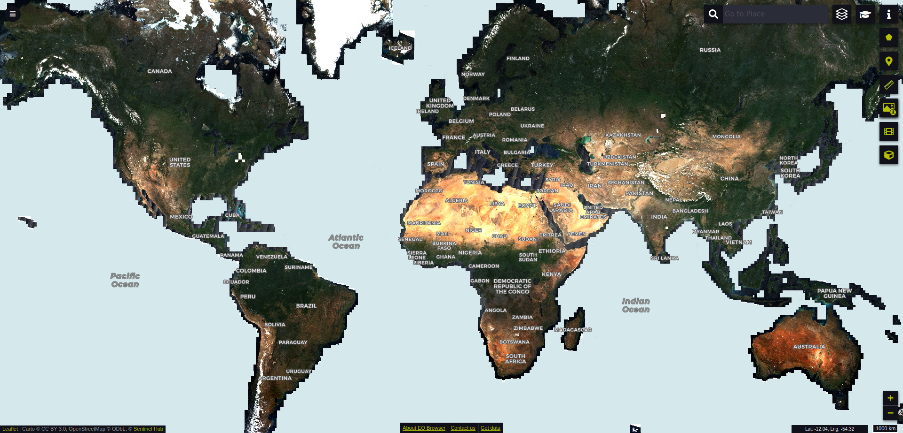

# Sentinel-2 L2A 120m Mosaic-2019

Sentinel-2 L2A 120m mosaic is a derived product, which contains best pixel values for 10-daily periods, modelled by removing the cloudy pixels and then performing interpolation among remaining values. As there are some parts of the world, which have lengthy cloudy periods, clouds might be remaining in some parts. The actual modelling script is available [here](https://sentinel-hub.github.io/custom-scripts/sentinel-2/interpolated_time_series/).  Sentinel-2 L2A 120m Mosaic 2019 product contains 6 of Sentinel 2 L2A bands.

## Resources and access details

|Name | Description|
| ------ | ------ |
| End Point  | `services.sentinel-hub.com` |
| Type | `byoc-0074520d-bcf5-4811-8f6f-afd946e77695`|
| Collection_id |`0074520d-bcf5-4811-8f6f-afd946e77695`  |  

| Name | Description |
| ------ | ------ |
| End Point  | `creodias.sentinel-hub.com` |
| Type | `byoc-eaa027cc-1d9b-40fc-a15c-9dc486caebd7`|
| Collection_id |`eaa027cc-1d9b-40fc-a15c-9dc486caebd7 ` |

## Band information
Sentinel-2 L2A 120m Mosaic 2019 product contains 6  bands as described in table 1 below. Find more information about sentinel 2 L2A bands [here](https://docs.sentinel-hub.com/api/latest/data/sentinel-2-l2a/#available-bands-and-data)   
**Table 1: Bands** 
<table>
  <thead>
    <tr>
      <th>Name</th>
      <th>Description </th>
      <th>Notes</th>
    </tr>
  </thead>
  <tbody>
    <tr>
      <td>B02 </td>
      <td>Blue </td>
      <td>DN, typically from 0-10000</td>
    </tr>
    <tr>
      <td> B03</td>
      <td> Green </td>
      <td>DN, typically from 0-10000 </td>
    </tr>
    <tr>
      <td> B04</td>
      <td> Red </td>
      <td>DN, typically from 0-10000 </td>
    </tr>
    <tr>
      <td> B08</td>
      <td> NIR </td>
      <td>DN, typically from 0-10000 </td>
    </tr>
    <tr>
      <td> B11</td>
      <td> SWIR </td>
      <td> DN, typically from 0-10000 </td>
    </tr>
    <tr>
      <td> B12</td>
      <td> SWIR </td>
      <td> DN, typically from 0-10000 </td>
    </tr>

  </tbody>
</table>   

## More information  

### Representative images

*Yearly time-lapse of the world, using 2019 Sentinel-2 L2A data.*

*Screenshot of the same data in EO Browser*

