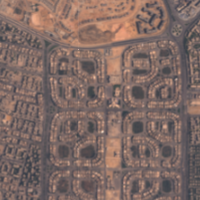
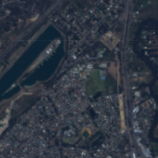

## SkySat Sandbox Data

This sandbox collection of <a href="../skysat/">SkySat</a> offers a limited area and time of interest. Only Planet accounts and Sentinel Hub accounts with a paid subscription have access under the <a href="https://creativecommons.org/licenses/by-nc/4.0/" target="_blank">CC-BY-NC license</a>.

### Collections
<table>
  <thead>
    <tr>
      <th>Source ID</th>
      <th>Collection Name</th>
      <th>Collection ID</th>
      <th>Time Range</th>
    </tr>
  </thead>
  <tbody>
    <tr>
      <td>Ortho_analytic (analytic_udm2)</td>
      <td>Planet Sandbox Data - SkySat</td>
      <td>BYOC-fc704520-fc81-439f-9016-5e162c32e736</td>
      <td>2021-01-01 - 2022-12-31</td>
    </tr>
   </tbody>
</table>

### Sandbox Areas
*Insert map here*

<a href="../skysat/polygons.geojson" download>Download GeoJSONs</a>

 
 

To purchase data over your own areas and times of interest, <a href="https://www.planet.com/contact-sales/#contact-sales)" target="_blank">contact Planet</a>. 

### EO Browser highlights
3 area samples are available as EO Browser Highlight Visualisations.
 

    

    
         

            
Bahia, Brazil

            

                2021-01-04 to 2022-12-28 
                25km2
            

            
<a href='https://apps.sentinel-hub.com/eo-browser/?zoom=14&lat=-9.46769&lng=-40.83146&themeId=PLANET_SANDBOX&visualizationUrl=https%3A%2F%2Fservices.sentinel-hub.com%2Fogc%2Fwms%2Fc0d9df19-9fb2-4191-89bd-4168678def5d&datasetId=fc704520-fc81-439f-9016-5e162c32e736&fromTime=2022-05-07T00%3A00%3A00.000Z&toTime=2022-05-07T23%3A59%3A59.999Z&layerId=TRUE-COLOR&demSource3D="MAPZEN"' target="_blank">Visualise in EO Browser -></a>

        

    

    

    
        

            
Cairo, Egypt

            

                2021-04-16 to 2022-09-22 
                25km2
            

           
<a href='https://apps.sentinel-hub.com/eo-browser/?zoom=14&lat=30.05862&lng=31.47&themeId=PLANET_SANDBOX&visualizationUrl=https%3A%2F%2Fservices.sentinel-hub.com%2Fogc%2Fwms%2Fc0d9df19-9fb2-4191-89bd-4168678def5d&datasetId=fc704520-fc81-439f-9016-5e162c32e736&fromTime=2022-08-19T00%3A00%3A00.000Z&toTime=2022-08-19T23%3A59%3A59.999Z&layerId=TRUE-COLOR&demSource3D="MAPZEN"' target="_blank">Visualise in EO Browser -></a>

        

    

    

    
        

            
Perth, Australia

            

                2021-01-01 to 2022-12-28 
                25km2
            

            
<a href='https://apps.sentinel-hub.com/eo-browser/?zoom=14&lat=-32.1112&lng=116.0231&themeId=PLANET_SANDBOX&visualizationUrl=https%3A%2F%2Fservices.sentinel-hub.com%2Fogc%2Fwms%2Fc0d9df19-9fb2-4191-89bd-4168678def5d&datasetId=fc704520-fc81-439f-9016-5e162c32e736&fromTime=2022-10-19T00%3A00%3A00.000Z&toTime=2022-10-19T23%3A59%3A59.999Z&layerId=TRUE-COLOR&demSource3D="MAPZEN"' target="_blank">Visualise in EO Browser -></a>

        

    

 

Discover more <a href="../planet-sandbox-data/">Planet Sandbox Data collections</a>