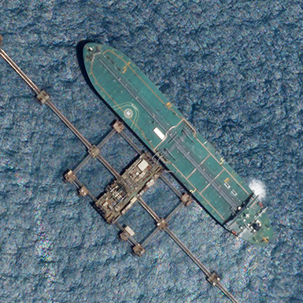

# SkySat Sandbox Data
<!---
TODO: add links
-->

The <a href="https://www.planet.com/products/planet-imagery/">SkySat</a> satellite constellation consists of 21 satellites that were launched between 2013 and 2020. The satellites are based on a CubeSat concept, but are slightly larger than the PlanetScope satellites. Because of its rapid revisit time, these data are suitable for monitoring rapid changes on the Earth's surface. Note, however, that the data acquisition must be tasked, i.e. the data is not acquired systematically.

A collection of SkySat for a limited area and time of interest is available with the CC-BY-SA license.

## Collections
<table>
  <thead>
    <tr>
      <th>Source ID</th>
      <th>Collection ID</th>
      <th>Time Range</th>
    </tr>
  </thead>
  <tbody>
    <tr>
      <td>Ortho_analytic (analytic_udm2)</td>
      <td>BYOC-fc704520-fc81-439f-9016-5e162c32e736</td>
      <td>2021-01-01 - 2022-12-31</td>
    </tr>
   </tbody>
</table>

## Sandbox Areas
To access data over your own areas and times of interest, [contact Planet](https://www.planet.com/contact-sales/#contact-sales).
  
*Insert map here*
  
[Download GeoJSONs]()

## EO Browser highlights
3 area samples are available as EO Browser Highlight Visualisations.
 

    

        
        

            
Nebraska, United States

            

                2019-01-01 to 2022-12-31 
                25km2 
                Visualise in EO Browser ->
            

        

    

    

        
        

            
Bordeaux, France

            

                2019-01-01 to 2022-12-31 
                25km2 
                Visualise in EO Browser ->
            

        

    

    

        
        

            
Lorem ipsum, Slovenia

            

                2019-01-01 to 2022-12-31 
                25km2 
                Visualise in EO Browser ->
            

        

    

 
<!---
TODO: add link
-->

Discover more [Planet Sandbox Data collections]().
