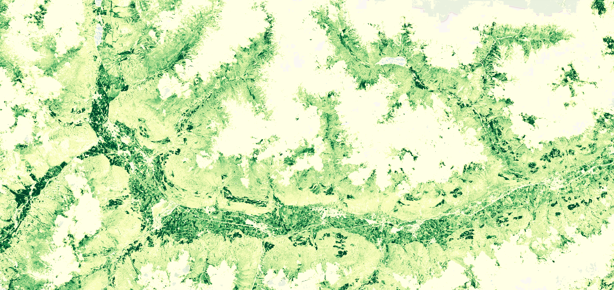

# Vegetation Indices, Daily

## Short description
  VVegetation Indices (VI) product is part of the Copernicus Land Monitoring Service (CLMS), pan-European High Resolution Vegetation Phenology and Productivity [(HR-VPP)](https://land.copernicus.eu/pan-european/biophysical-parameters/high-resolution-vegetation-phenology-and-productivity) product suite. 
  The product is comprised of 4 raw Vegetation Indices; (1) Normalized Difference Vegetation Index (NDVI), (2) Leaf Area Index (LAI), 
  (3) Fraction of Absorbed Photosynthetically Active Radiation (FAPAR) and (4) Plant Phenology Index (PPI) generated near real-time (NRT) from Sentinel-2 satellite observations. 
  The raw Vegetation Indices are provided on a daily basis at 10m resolution from October 2016 onwards. Therefore VI products are available over the EEA39 region for the respective observation day 
  based on 5-day revisit period of Sentinel-2. The VIs are accompanied by  a related QFLAG2 band that flags clouds, shadows, snow, open water and other areas where the VI retrieval is less reliable. 
  More information about raw vegetation indices is outlined in the [product user manual](https://land.copernicus.eu/user-corner/technical-library/product-user-manual-of-vegetation-indices/)

## Band information
The available bands include: 4 raw vegetation indices and QFLAG2. 

### Plant Phenology Index (PPI)
PPI is a physically-based vegetation index derived from radiative transfer equation and is is calculated from red and Near-Infrared (NIR) spectral bands. PPI is  linearly related to green leaf area index, and can be used to track canopy green foliage dynamics and therefore provides an efficient approach to retrieving plant phenology.  
Physical values range from 0 to 3.

### Normalized Difference Vegetation Index (NDVI)
NDVI quantifies vegetation photosynthetic capacity by measuring the difference between the Near-Infrared (NIR) (which vegetation strongly reflects) and red spectral bands (which vegetation absorbs). Although it is not a physical property of vegetation cover, NDVI is widely used as an indicator for live green vegetation monitoring.  
Physical values range from -1 to 1.

### Fraction of Absorbed Photosynthetically Active Radiation (FAPAR)
FAPAR corresponds to the fraction of photosynthetically active radiation absorbed by the canopy. FAPAR describes only the green parts of the canopy. FAPAR is very useful in assessing the primary productivity of canopies.  
Physical values range from 0 to 1.  

### Leaf Area Index (LAI)
LAI is defined as one half of the total  area of photosynthetically active elements of the canopy per unit horizontal ground area. The LAI provided by HRVPP corresponds to actual LAI of all the canopy layers, including all green contributors. Practically, the LAI quantifies the thickness of the vegetation cover.
Physical values range from 0 to 8.

### Quality Flag (QFLAG2)

<table>
  <thead>
    <tr>
      <th>Value</th>
      <th>Class name</th>
      <th>Description</th>
    </tr>
  </thead>
  <tbody>
    <tr>
      <td>1</td>
      <td>Clear Land </td>
      <td>Clear-sky land observation (propagated from base SCL class 4 and 5)</td>
    </tr>
    <tr>
      <td>2</td>
      <td >Clear Water</td>
      <td>Clear-sky water observation (propagated from base SCL class 6)</td>
    </tr>
    <tr>
      <td>4</td>
      <td >Cloud </td>
      <td>Cloud detected (propagated from base SCL class 8 and 9)</td>
    </tr>
    <tr>
      <td>8</td>
      <td >Cloud shadow </td>
      <td>Pixel located within the projection of a detective cloud defined using the solar elevation and azimuth and limited to 9km distance from the cloud</td>
    </tr>
    <tr>
      <td>16</td>
      <td>Topographic shadow </td>
      <td>Topographic shadow, shadow detected located outside cloud projection and within estimated topographic shadow (propagated from base SCL class 2)</td>
    </tr>
    <tr>
      <td>32</td>
      <td>Thin cirrus </td>
      <td>Dense semi-transparent cloud, classified as haze or dense semi-transparent cloud (propagated from base SCL class 10)</td>
    </tr>
    <tr>
      <td>64</td>
      <td>Snow </td>
      <td>Clear-sky observation classified as snow (propagated from base SCL class 11)</td>
    </tr>
    <tr>
      <td>128</td>
      <td>Snow extra </td>
      <td>Clear-sky observation classified as snow (propagated from HR Snow&Ice)</td>
    </tr>
    <tr>
      <td>256</td>
      <td>Unclassified </td>
      <td>Propagated from base SCL class 7</td>
    </tr>
    <tr>
      <td>512</td>
      <td>Eroded </td>
      <td>Cloud or cloud shadow pixel located within 8 pixels at edge of the cloud or cloud shadow</td>
    </tr>
    <tr>
      <td>1024</td>
      <td>Cloud proximity </td>
      <td>Clear-sky pixel located closer than 20 pixels of detected cloud</td>
    </tr>
    <tr>
      <td>2048</td>
      <td>Cloud shadow proximation </td>
      <td>Clear-sky pixel located closer than 30pixels of detected cloud shadow</td>
    </tr>
    <tr>
      <td>4096</td>
      <td>Extended cloud proximity </td>
      <td>Clear-sky pixel located closer than 60 pixels of detected cloud</td>
    </tr>
    <tr>
      <td>8192</td>
      <td>Extended cloud shadow proximity </td>
      <td>Clear sky pixel located closer than 50 pixels of detected cloud shadow</td>
    </tr>
    <tr>
      <td>16384</td>
      <td>Reserved </td>
      <td>Reserved for future use</td>
    </tr>
    <tr>
      <td>32768</td>
      <td>Reserved </td>
      <td>Reserved for future use</td>
    </tr>
    <tr>
      <td>65535</td>
      <td>Invalid </td>
      <td>No value</td>
    </tr>
   </tbody>
</table> 

## More information  

### Representative Images 

 

*FAPAR August 2019, South Tyrol Northern Italy.*

 
 

 

*NDVI August 2019, South Tyrol Northern Italy.*

 
 

 

*PPI August 2019, South Tyrol Northern Italy.*
