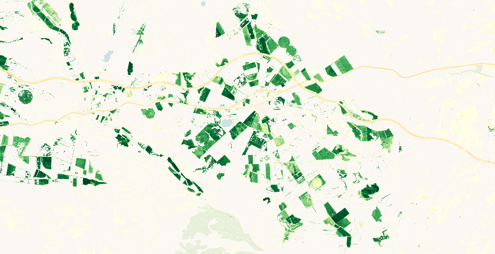
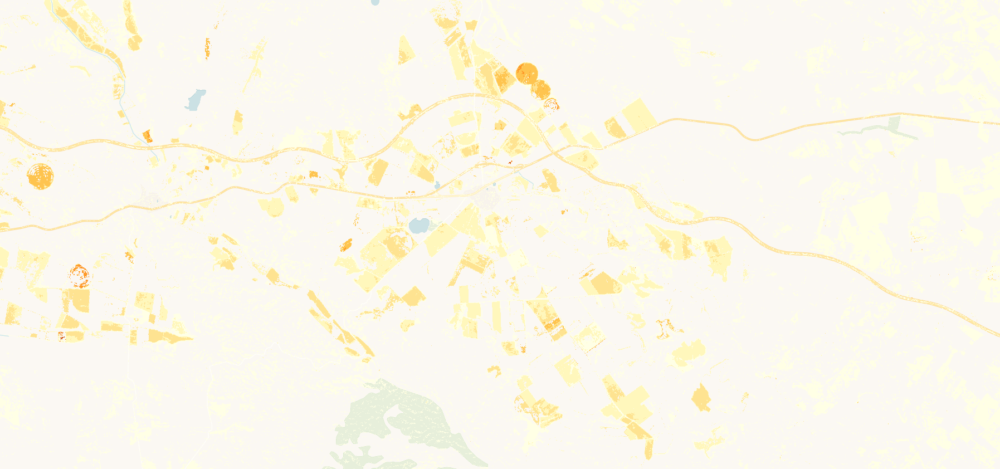
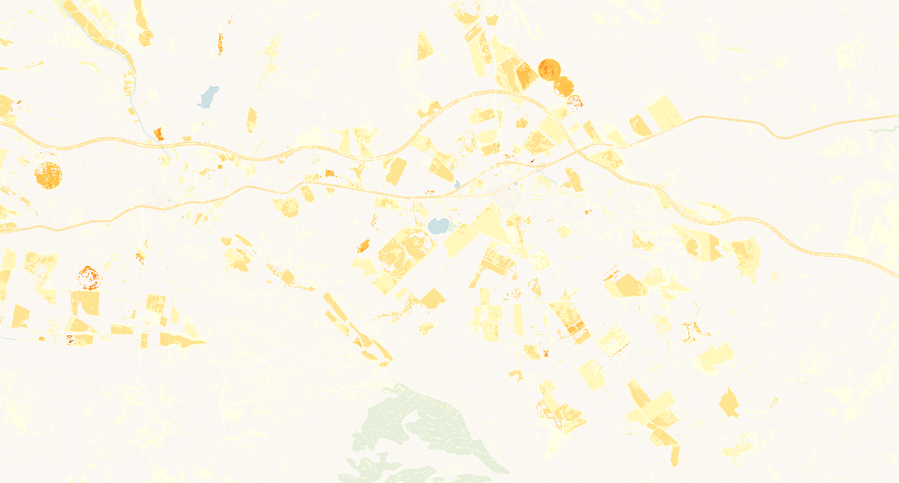

# Vegetation Phenology and Productivity Parameters Season 2, Yearly

## Short description
Vegetation Phenology and Productivity Parameters (VPP) product is part of the Copernicus Land Monitoring Service (CLMS), 
pan-European High Resolution Vegetation Phenology and Productivity [(HR-VPP)](https://land.copernicus.eu/pan-european/biophysical-parameters/high-resolution-vegetation-phenology-and-productivity) product suite. 
The VPP product is comprised of 13 parameters that describe specific stages of the seasonal vegetation growth cycle. 
These parameters are extracted from Seasonal Trajectories of the [Plant Phenology Index(PPI)](https://www.nateko.lu.se/research/remote-sensing-and-earth-observation/lund-earth-observation-research-group/vegetation-phenology) derived from Sentinel-2 satellite observations at 10m resolution. Since growing seasons can traverse years, VPP parameters are provided for a maximum of two growing seasons per year. 
The  parameters include (1) start of season (date, PPI value and slope), (2) end of season (date, PPI value and slope), (3)length of season, (4) minimum of season, 
(4) peak of the season (date and PPI value), (5) amplitude, (6) small integrated value and (7) large integrated value. 
VPP parameters are generated over the EEA39 region on a yearly frequency from January 1 2017 onwards. 
Among other applications, the high-resolution phenology data provides a detailed assessment of the impacts of 
human or climate change on the ecosystem through monitoring of vegetation responses to disturbances, e.g. droughts, storms, insect infestations, and to human influence from global to local levels. 
More information about VPP product methodology and workflow is outlined in the [product user manual](https://land.copernicus.eu/user-corner/technical-library/product-user-manual-of-seasonal-trajectories/)

## Band information
The available bands include: 13 parameters and QFLAG

### QFLAG

<table>
  <thead>
    <tr>
      <th>Value</th>
      <th>Quality</th>
      <th>Definition</th>
    </tr>
  </thead>
  <tbody>
    <tr>
      <td>10</td>
      <td >High </td>
      <td>More than 2 clear-sky land observations found during green up, green down and green peak</td>
    </tr>
    <tr>
      <td>9</td>
      <td >Medium </td>
      <td>More than 2 clear-sky land observations found during green down and green peak</td>
    </tr>
    <tr>
      <td>8</td>
      <td >Medium </td>
      <td>More than 2 clear-sky land observations found during green up and green down</td>
    </tr>
    <tr>
      <td>7</td>
      <td >Medium </td>
      <td>More than 2 clear-sky land observations found during green up and green peak</td>
    </tr>
    <tr>
      <td>6</td>
      <td >Low </td>
      <td>More than 2 clear-sky land observations found during green up</td>
    </tr>
    <tr>
      <td>5</td>
      <td >Low </td>
      <td>More than 2 clear-sky land observations found during green peak</td>
    </tr>
    <tr>
      <td>4</td>
      <td >Low </td>
      <td>More than 2 clear-sky land observations found during green down</td>
    </tr>
    <tr>
      <td>3</td>
      <td > </td>
      <td>Reserved</td>
    </tr>
    <tr>
      <td>2</td>
      <td >Filled </td>
      <td>Cannot find more than 2 clear-sky land observations during green up, green down or green peak</td>
    </tr>
    <tr>
      <td>1</td>
      <td >No season found </td>
      <td>No season found (the time series was processed)</td>
    </tr>
    <tr>
      <td>0</td>
      <td >No data </td>
      <td>The time series was not processed.</td>
    </tr>
   </tbody>
</table> 

## More information
### Representative Images 

*Vegetation index value at day of maximum of season 2, 2019, Candasnos Spain.*   

 
 

*Seasonal productivity season 2, 2019, Candasnos Spain.*  

 
 

*Total productivity season 2, 2019, Candasnos Spain.*
