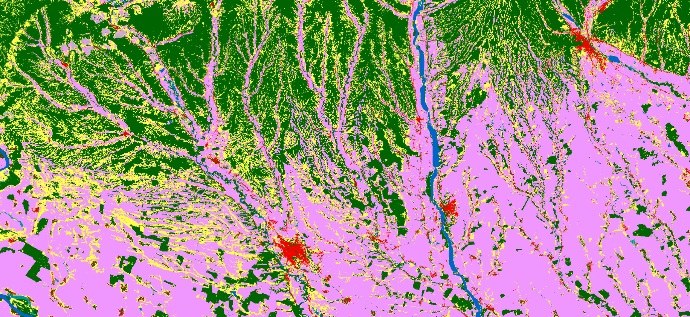
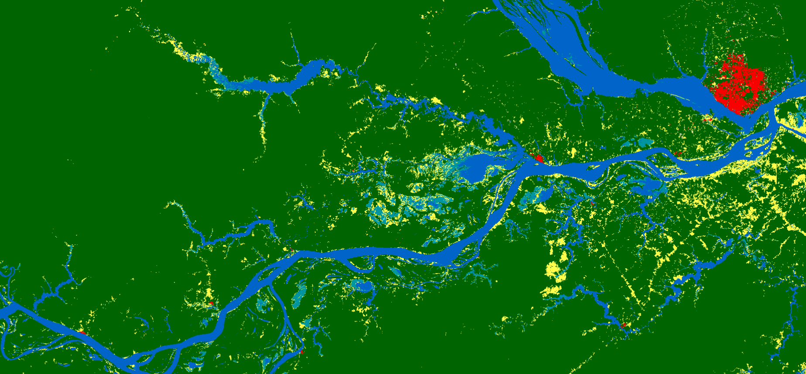

# WorldCover

## Short description
  [WorldCover](https://esa-worldcover.org/en) is a global land cover map produced at 10m resolution based on combination of both Sentinel-1 and Sentinel-2 data. 
  In areas where Sentinel-2 images are covered by clouds for an extended period of time, Sentinel-1 data then provides complimentary information on the structural 
  characteristics of the observed land cover. Therefore, the combination of Sentinel-1 and Sentinel-2 data makes it possible to update the land cover map almost in real time. 
  WorldCover has been produced for 2020 with a global coverage. It provides valuable information for many applications such as biodiversity, food security, carbon assessment and climate modelling.

## Band information
WorldCover product has 1 band named `Map`. The values of this band are described below.  

### WorldCover Map classes description

<table>
  <thead>
    <tr>
      <th>Value</th>
      <th>Color</th>
      <th>Color Code</th>
	    <th>Class Name</th>
    </tr>
  </thead>
  <tbody>
    <tr>
      <td>10 </td>
      <td style="background-color:#006400"></td>
	    <td>0x006400 </td>
	    <td>Tree cover </td>
    </tr>
    <tr>
      <td>20</td>
      <td style="background-color:#ffbb22"></td>
	    <td>0xffbb22 </td>
	    <td>Shrubland </td>
    </tr>
    <tr>
      <td>30</td>
      <td style="background-color:#ffff4c"></td>
	    <td>0xffff4c </td>
	    <td>Grassland </td>
    </tr>
    <tr>
      <td>40</td>
      <td style="background-color:#f096ff" ></td>
	    <td>0xf096ff  </td>
	    <td>Cropland </td>
    </tr>
    <tr>
      <td>50</td>
      <td style="background-color:#fa0000" ></td>
	    <td>0xfa0000 </td>
	    <td>Built up </td>
    </tr>
    <tr>
      <td>60</td>
      <td style="background-color:#b4b4b4"></td>
	    <td> 0xb4b4b4 </td>
	    <td> Bare /sparse vegetation </td>
    </tr>  
    <tr>
      <td>70</td>
      <td style="background-color:#f0f0f0"></td>
	    <td>0xf0f0f0 </td>
	    <td>Snow and Ice </td>
    </tr> 
    <tr>
      <td>80</td>
      <td style="background-color:#0032c8"></td>
	    <td>0x0064c8  </td>
	    <td>Permanent water bodies </td>
    </tr> 
    <tr>
      <td>90</td>
      <td style="background-color:#0096a0"></td>
	    <td>0x0096a0 </td>
	    <td>Herbaceous wetland </td>
    </tr>
    <tr>
      <td>95</td>
      <td style="background-color:#00cf75"></td>
	    <td>0x00cf75 </td>
	    <td>Mangroves </td>
    </tr>
    <tr>
      <td>100</td>
      <td style="background-color:#fae6a0"></td>
	    <td>0xfae6a0 </td>
	    <td>Moss and lichen </td>
    </tr>
    <tr>
      <td>0</td>
      <td></td>
      <td></td>
	    <td> No data </td>
    </tr>
   </tbody>
</table> 

## More information  

### Representative Images 

 
 

 

*WorldCover 2020, river Olt, South of Romania visualised on EO Browser.*

 
 

 

*WorldCover 2020, Manaus Amazonas Brazil visualised on EO Browser*
